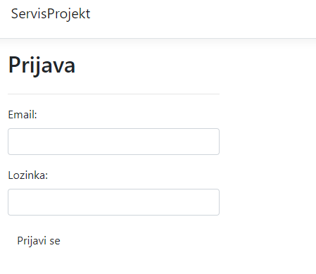

# Zavrsni_rad
Aplikacija služi za prijavu servisa od stranke prema poduzeću koje se bavi servisom printera. Uvidom u prijave od strane servisa, te mogućnošću dodavanja novih poduzeća i korisnika od strane administratora koji je zaposlen u servisu.

Prilikom otvaranja stranice prikazuje se Login: 

Nakon logina korisnik ima uvid u popis prijavljenih printera, detaljnije izglede prijave, prijave kvara, itd. 
Ovisno o dozvolama koje user ima.

Izgled ekrana popisa prijava: 

Izgled ekrana prijave kvara:  

Izgled ekrana Detaljnijeg izgleda prijave kvara:  

Izgled ekrana izrade radnog naloga:  

